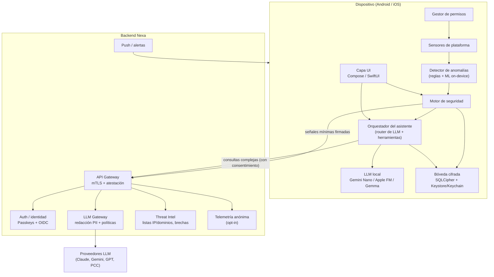
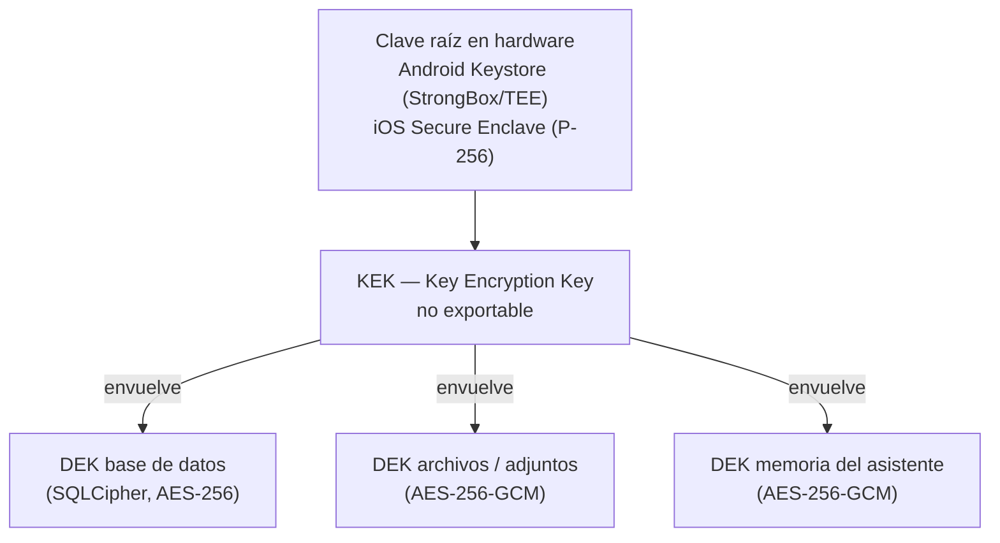
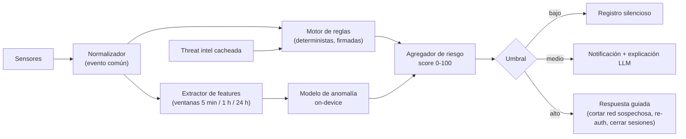
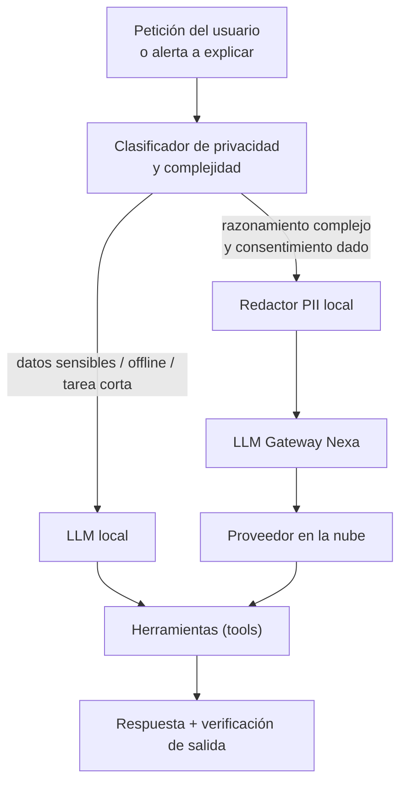

# Nexa IA — Arquitectura técnica

Asistente personal + monitor de seguridad móvil (Android e iOS)
Versión 1.0 · Octubre 2026

> Documento de diseño de la **versión nativa** de Nexa IA, tal como lo definió el dueño del proyecto.
> Qué parte ya funciona en la app web (PWA) de esta carpeta, y qué queda para la versión nativa: ver [`ALCANCE.md`](ALCANCE.md).

---

## 1. Visión y alcance realista

Nexa IA combina dos productos en una sola app:

1. **Asistente personal**: conversación, resúmenes, recordatorios, explicación de alertas de seguridad en lenguaje natural.
2. **Monitor de seguridad**: detecta señales de acceso no autorizado y compromiso (de la cuenta, del dispositivo y de la red) y guía al usuario en la respuesta.

### Restricción clave de plataforma (define todo el diseño)

| Capacidad | Android | iOS |
|---|---|---|
| Ver qué apps se usan y cuándo | Sí, `UsageStatsManager` (permiso especial concedido por el usuario) | No (sandbox; Screen Time API solo entrega datos agregados/opacos) |
| Listar apps instaladas | Limitado: `QUERY_ALL_PACKAGES` requiere justificación en Play; usar `<queries>` | No |
| Inspeccionar tráfico de red del dispositivo | Sí, vía `VpnService` local (sin enviar tráfico fuera) | Sí, vía Network Extension (`NEPacketTunnelProvider` / filtro DNS), con entitlement |
| Detectar root/jailbreak, debugger, hooking | Sí (heurísticas + Play Integrity) | Sí (heurísticas + App Attest/DeviceCheck) |
| Detectar intentos de desbloqueo fallidos | Solo como Device Admin / Device Policy (uso restringido) | No |
| Servicio en segundo plano continuo | Foreground Service con notificación persistente | No; solo BGTaskScheduler, extensiones y push silenciosos |

Conclusión: **Android permite monitoreo a nivel dispositivo; iOS permite monitoreo a nivel red, cuenta e integridad de la propia app.** La arquitectura es común, pero los "sensores" son distintos por plataforma. Prometer en iOS un "antivirus" que escanee otras apps sería falso e iría contra las App Store Review Guidelines.

---

## 2. Arquitectura general



### Principios

- **Local-first**: la detección y el almacenamiento ocurren en el dispositivo. La nube solo recibe lo mínimo necesario.
- **Zero-trust con el backend**: cada petición lleva token de atestación de la app y sesión ligada a una clave de hardware.
- **Defensa en profundidad**: cifrado en reposo, en tránsito y protección del binario.
- **Explicabilidad**: cada alerta tiene evidencia estructurada; el LLM la explica, pero **nunca decide solo** acciones destructivas.

---

## 3. Stack tecnológico recomendado

| Capa | Android | iOS | Compartido |
|---|---|---|---|
| Lenguaje / UI | Kotlin + Jetpack Compose | Swift + SwiftUI | — |
| Lógica de negocio común | Kotlin Multiplatform (KMP) | KMP (framework) | Reglas de detección, modelos de dominio, cliente API |
| Base de datos | SQLCipher (vía Room o SQLDelight) | SQLCipher (vía SQLDelight) o GRDB + SQLCipher | Esquema único con SQLDelight |
| Claves | Android Keystore (StrongBox si existe) | Keychain + Secure Enclave | — |
| ML on-device | LiteRT (TFLite) | Core ML | Modelos exportados desde el mismo pipeline |
| LLM on-device | ML Kit GenAI (Gemini Nano / AICore); fallback Gemma vía LiteRT-LM / MediaPipe | Foundation Models framework; fallback Core AI / MLX | Contrato de herramientas común |
| Red | OkHttp + certificate pinning | URLSession + pinning (`NSPinnedDomains`) | — |
| Backend | — | — | Kotlin (Ktor) o Go; PostgreSQL; Redis; colas (NATS/Kafka) |

Por qué KMP y no Flutter/React Native: el núcleo de seguridad necesita acceso nativo profundo (Keystore, Secure Enclave, Network Extension, VpnService). KMP comparte la lógica sin interponer un runtime adicional que amplía la superficie de ataque.

---

## 4. Gestión segura de permisos

### 4.1 Modelo de permisos progresivo

Ningún permiso se pide al instalar. Se piden **en contexto**, cuando el usuario activa la función que lo requiere, con pantalla previa que explica qué se lee, qué no y dónde queda.

| Módulo | Android | iOS | Nivel |
|---|---|---|---|
| Notificaciones de alerta | `POST_NOTIFICATIONS` | `UNUserNotificationCenter` | Básico |
| Autenticación biométrica | `USE_BIOMETRIC` | Face ID (`NSFaceIDUsageDescription`) | Básico |
| Monitor de uso de apps | `PACKAGE_USAGE_STATS` (ajuste especial) | No disponible | Avanzado |
| Monitor de red / DNS | `VpnService` (diálogo del sistema) | Network Extension + perfil VPN | Avanzado |
| Ubicación (accesos desde lugares inusuales) | `ACCESS_COARSE_LOCATION` (evitar fina) | `CoreLocation` "While Using" | Opcional |
| Servicio continuo | `FOREGROUND_SERVICE_SPECIAL_USE` o `..._DATA_SYNC` | BGTaskScheduler | Avanzado |

Permisos que **no** se usan por política/riesgo: `AccessibilityService` (Google Play lo restringe a casos de accesibilidad real y es un vector clásico de malware), lectura de SMS/llamadas, Device Admin salvo versión empresarial (MDM).

### 4.2 Componente `PermissionManager` (KMP + capa nativa)

```kotlin
// commonMain
enum class Capability { NOTIFY, BIOMETRIC, USAGE_STATS, NETWORK_MONITOR, LOCATION_COARSE }

data class PermissionState(val capability: Capability, val granted: Boolean,
                           val grantedAt: Instant?, val rationaleShown: Boolean)

interface PermissionManager {
    fun status(c: Capability): PermissionState
    suspend fun request(c: Capability, rationale: Rationale): PermissionState
    fun observe(): Flow<List<PermissionState>>   // detecta revocaciones
}
```

- Registra en la bóveda cada concesión/revocación (auditable por el usuario).
- Si un permiso se revoca, el módulo dependiente se degrada con un aviso, no falla en silencio.
- Panel "Privacidad" que lista qué datos recolecta cada módulo y permite borrarlos.

---

## 5. Cifrado de datos locales

### 5.1 Jerarquía de claves



- **Clave raíz no exportable**, generada en hardware. En iOS el Secure Enclave solo maneja claves EC, por lo que se usa ECDH + HKDF para derivar la clave simétrica de envoltura.
- **DEKs aleatorias** de 256 bits, almacenadas solo envueltas (cifradas) por la KEK.
- **Rotación**: re-envolver DEKs al rotar la KEK (sin re-cifrar toda la base).
- **Bloqueo por biometría** para la DEK de "memoria del asistente" y del historial de alertas sensibles:
  - Android: `setUserAuthenticationRequired(true)` + `setUserAuthenticationParameters(timeout, AUTH_BIOMETRIC_STRONG)`; `setInvalidatedByBiometricEnrollment(true)`.
  - iOS: `SecAccessControl` con `.biometryCurrentSet` y `kSecAttrAccessibleWhenUnlockedThisDeviceOnly`.

### 5.2 Almacenamiento

| Dato | Ubicación | Protección |
|---|---|---|
| Eventos de seguridad, perfiles de comportamiento | SQLCipher | DEK1 |
| Conversaciones y memoria del asistente | SQLCipher (tablas separadas) | DEK3 + biometría |
| Tokens de sesión | Keystore / Keychain directamente | `ThisDeviceOnly`, sin backup |
| Preferencias no sensibles | DataStore / UserDefaults | Sin datos personales |
| Modelos ML | Archivos de app | Verificación de firma/hash al cargar |

Reglas adicionales:

- iOS: Data Protection `NSFileProtectionComplete` para archivos sensibles; excluir de iCloud backup.
- Android: `android:allowBackup="false"` o reglas `dataExtractionRules` que excluyan la base cifrada.
- Borrado seguro: destruir la DEK equivale a borrado criptográfico instantáneo (botón "Borrar todo").
- Pantallas sensibles: `FLAG_SECURE` en Android; ocultar contenido al pasar a segundo plano en iOS.

### 5.3 Cifrado en tránsito

- TLS 1.3 obligatorio, **certificate pinning** con al menos 2 pines (actual + respaldo).
- Sesiones ligadas al dispositivo: cada petición se firma con una clave de hardware (estilo DPoP), así un token robado no sirve en otro equipo.
- Atestación de app en endpoints críticos: Play Integrity API en Android y App Attest en iOS, con nonce emitido por el servidor y verificación en backend.

---

## 6. Detección de anomalías en tiempo real

### 6.1 Sensores (fuentes de señales)

| Familia | Señales | Android | iOS |
|---|---|---|---|
| Integridad del dispositivo | Root/jailbreak, bootloader desbloqueado, emulador, debugger, Frida/hooking, firma de app alterada | Sí | Sí |
| Postura de seguridad | Sin bloqueo de pantalla, parches viejos, opciones de desarrollador, fuentes desconocidas | Sí | Parcial (passcode vía `LAContext`) |
| Red | Wi-Fi abierta, cambios de DNS, certificados CA de usuario, dominios/IP maliciosos, volumen anómalo de datos | Sí (VpnService) | Sí (Network Extension) |
| Uso de apps | App poco usada que se activa de noche, app nueva con actividad intensa inmediata | Sí (UsageStats) | No |
| Cuenta | Inicios de sesión nuevos en Nexa, cambio de dispositivo, correo del usuario en brechas conocidas | Sí | Sí |
| Contexto | Ubicación aproximada, hora, carga, pantalla bloqueada | Sí | Parcial |

### 6.2 Pipeline de detección



Evento normalizado (común KMP):

```kotlin
data class SecurityEvent(
    val id: Uuid, val ts: Instant, val source: Source,   // NETWORK, INTEGRITY, USAGE, ACCOUNT...
    val type: String, val severityHint: Int,
    val attributes: Map<String, String>,                  // sin PII en claro
    val evidenceHash: String
)
```

Capas de detección:

1. **Reglas deterministas** (alta precisión, explicables): "CA de usuario instalada + Wi-Fi abierta", "dominio en lista de phishing", "debugger adjunto a Nexa". Se distribuyen como paquete firmado (Ed25519) y versionado desde el backend.
2. **Modelo de comportamiento personal** (aprende la línea base del usuario en 7–14 días):
   - Primera versión: Isolation Forest o estadística robusta (z-score con mediana/MAD) por feature.
   - Segunda versión: autoencoder pequeño (< 1 MB) en LiteRT / Core ML sobre secuencias horarias de uso de red y apps.
   - Entrenamiento/ajuste en el dispositivo; nada de la línea base sale del teléfono.
3. **Agregador de riesgo**: combina reglas y modelo con pesos, decaimiento temporal y supresión de duplicados para evitar fatiga de alertas.

Tiempo real y batería:

- Android: Foreground Service liviano solo si el usuario activa "Protección continua"; el resto con WorkManager cada 15 min.
- iOS: la Network Extension corre como proceso del sistema; la app principal procesa en `BGAppRefreshTask` / `BGProcessingTask` y al abrirse.
- Presupuesto objetivo: < 2 % de batería diaria, < 50 MB RAM del servicio.

### 6.3 Respuesta a incidentes (playbooks)

| Detección | Acción automática | Acción sugerida al usuario |
|---|---|---|
| Dominio malicioso | Bloqueo DNS local | Revisar la app que lo originó (Android) |
| Root/jailbreak nuevo | Bloquear la bóveda hasta re-autenticación | Explicación de riesgos |
| Sesión Nexa desde dispositivo desconocido | Push al resto de dispositivos | Revocar sesión con un toque |
| Correo en brecha | — | Cambiar contraseña, activar passkeys/2FA |
| CA de usuario instalada | — | Guía para revisarla/eliminarla |

Las acciones destructivas o irreversibles siempre requieren confirmación biométrica.

---

## 7. Integración con LLM (on-device y nube)

### 7.1 Router híbrido



Motores on-device:

- iOS: Foundation Models framework (modelo local de Apple Intelligence, generación guiada con `@Generable` y tool calling). Desde WWDC26 la misma API soporta Private Cloud Compute y otros proveedores mediante un protocolo común. Requiere dispositivo compatible con Apple Intelligence; comprobar disponibilidad con `SystemLanguageModel.default`.
- Android: ML Kit GenAI APIs sobre AICore y Gemini Nano (resumen, reescritura, Prompt API). Lista de dispositivos limitada y Prompt API en beta, por lo que se necesita fallback.
- Fallback universal: modelo abierto pequeño (por ejemplo Gemma de 1–4B cuantizado) descargado bajo demanda vía LiteRT-LM / MediaPipe en Android y Core AI / MLX en iOS, verificado por hash.
- Sin LLM disponible: plantillas de texto predefinidas por tipo de alerta (la seguridad nunca depende del LLM).

Nube (opcional, con consentimiento explícito):

- El LLM Gateway propio es el único punto de salida: nunca se embeben claves de proveedores en la app.
- Funciones del gateway: autenticación del dispositivo, redacción de PII residual, límites de tasa por usuario, selección de proveedor/modelo, registro sin contenido (solo metadatos), retención cero con proveedores que la ofrezcan.

### 7.2 Abstracción común

```kotlin
interface LlmEngine {
    val id: String
    suspend fun isAvailable(): Boolean
    fun generate(req: LlmRequest): Flow<LlmChunk>          // streaming
}

data class LlmRequest(
    val system: String, val messages: List<Msg>,
    val tools: List<ToolSpec>, val schema: JsonSchema?,     // salida estructurada
    val privacy: PrivacyLevel                               // LOCAL_ONLY, REDACTED_CLOUD, CLOUD
)
```

En iOS, `LlmEngine` se implementa sobre `LanguageModelSession`; en Android, sobre ML Kit GenAI o LiteRT-LM.

### 7.3 Herramientas del asistente (tool calling)

| Herramienta | Permite | Riesgo | Control |
|---|---|---|---|
| `get_security_status` | Leer score y alertas recientes | Bajo | Lectura |
| `explain_event(id)` | Detalle de un evento | Bajo | Lectura |
| `list_sessions` | Ver sesiones activas | Medio | Lectura |
| `revoke_session(id)` | Cerrar sesión remota | Alto | Confirmación biométrica |
| `block_domain(d)` | Bloqueo DNS | Medio | Confirmación |
| `create_reminder` | Recordatorios | Bajo | — |

### 7.4 Seguridad del LLM

- Prompt injection: el contenido externo (nombres de Wi-Fi, dominios, textos de notificaciones) entra siempre como dato delimitado, nunca como instrucción. Las herramientas de alto riesgo no se ejecutan sin confirmación humana.
- Validación de salida contra esquema JSON; si falla, se reintenta o se usa plantilla.
- Lista blanca de herramientas por contexto (en modo "explicar alerta" no puede revocar sesiones).
- Evaluaciones automáticas (alertas de referencia y ataques de inyección) en CI.

---

## 8. Protección de la propia app (anti-tampering)

- Ofuscación: R8 con reglas estrictas (Android); stripping de símbolos y ofuscación de strings sensibles (iOS).
- Detección de hooking/debugging en ejecución (Frida, Xposed, Substrate), con respuesta gradual (degradar, avisar, bloquear bóveda).
- Verificación de integridad del binario y de paquetes de reglas/modelos (firmas).
- Atestación del servidor en cada operación sensible; el backend decide, no el cliente.
- RASP comercial para versiones empresariales.
- Checklist de auditoría: OWASP MASVS / MASTG.

---

## 9. Backend

| Servicio | Responsabilidad | Tecnología sugerida |
|---|---|---|
| API Gateway | mTLS, rate limiting, verificación de atestación | Envoy / Kong |
| Identidad | Registro, passkeys (WebAuthn), OIDC, gestión de dispositivos | Keycloak o servicio propio |
| LLM Gateway | Router de proveedores, redacción, cuotas, observabilidad | Ktor/Go + Redis |
| Threat Intel | Feeds de dominios/IP maliciosos y brechas; deltas firmados | Workers + PostgreSQL |
| Reglas y modelos | Versionado, firma Ed25519, despliegue canary | Object storage + CDN |
| Notificaciones | FCM / APNs | Servicio propio |
| Telemetría | Métricas agregadas y anónimas, opt-in | ClickHouse |

Datos personales en el servidor: solo cuenta, dispositivos y sesiones. Sin historial de uso ni conversaciones, salvo sincronización cifrada de extremo a extremo opcional.

Cumplimiento: Ley 25.326 de Protección de Datos Personales (Argentina), GDPR si hay usuarios en la UE, Data Safety (Google Play) y Privacy Labels (App Store).

---

## 10. Estructura del repositorio

```
nexa/
├── shared/                      # KMP
│   ├── domain/                  # SecurityEvent, RiskScore, Capability
│   ├── detection/               # motor de reglas, features, agregador
│   ├── assistant/               # orquestador, router LLM, tools
│   ├── data/                    # SQLDelight + SQLCipher, repositorios
│   └── network/                 # cliente API, firma de peticiones
├── androidApp/
│   ├── ui/                      # Compose
│   ├── sensors/                 # UsageStats, VpnService, integridad
│   ├── crypto/                  # Keystore, StrongBox
│   └── llm/                     # ML Kit GenAI, LiteRT-LM
├── iosApp/
│   ├── UI/                      # SwiftUI
│   ├── Sensors/                 # integridad, LAContext
│   ├── NetworkExtension/        # target separado (tunnel/DNS)
│   ├── Crypto/                  # Secure Enclave, Keychain
│   └── LLM/                     # Foundation Models, Core AI
├── backend/
│   ├── gateway/  identity/  llm-gateway/  threat-intel/  rules-registry/
├── ml/
│   ├── features/  training/  export/    # → .tflite / .mlmodel
└── security/
    ├── threat-model.md  masvs-checklist.md  pentest/
```

---

## 11. Plan de desarrollo paso a paso

Equipo supuesto: 2 móviles (Android + iOS), 1 backend, 1 ML/seguridad. Duración: ~9 meses hasta 1.0.

### Fase 0 — Fundamentos (semanas 1–3)
1. Modelado de amenazas (STRIDE) de app, backend y LLM.
2. Monorepo KMP, CI/CD (GitHub Actions + Fastlane), análisis estático (Detekt, SwiftLint, MobSF, Semgrep).
3. Revisión de políticas: Google Play (UsageStats, VpnService, Foreground Service) y App Store (Network Extension).
4. UX de permisos progresivos y textos de privacidad.

### Fase 1 — Núcleo seguro (semanas 4–8)
1. Jerarquía de claves, SQLCipher, bloqueo biométrico, borrado criptográfico.
2. Identidad con passkeys, sesiones ligadas a dispositivo, pinning.
3. Atestación (Play Integrity / App Attest) verificada en servidor.
4. `PermissionManager` con auditoría.
5. Pruebas de extracción de datos en dispositivos rooteados/jailbreak.

### Fase 2 — Detección v1 con reglas (semanas 9–14)
1. Sensores de integridad y postura.
2. Android: UsageStats + VpnService (DNS local); iOS: Network Extension.
3. Evento común, motor de reglas firmado, threat intel.
4. Agregador de riesgo, notificaciones y playbooks.
5. Medición de batería en gama baja. Entregable: alpha cerrada.

### Fase 3 — Asistente y LLM (semanas 15–20)
1. `LlmEngine` con Foundation Models (iOS) y ML Kit GenAI (Android).
2. Fallback a modelo abierto y a plantillas.
3. Herramientas con niveles de riesgo y confirmación biométrica.
4. LLM Gateway con redacción PII y cuotas.
5. Evaluación de calidad en español y resistencia a prompt injection. Entregable: beta cerrada.

### Fase 4 — Detección v2 con ML (semanas 21–26)
1. Features agregadas opt-in o datos sintéticos.
2. Línea base personal (Isolation Forest / MAD), luego autoencoder.
3. Calibración: < 1 alerta no accionable por semana.
4. Despliegue canary con rollback.

### Fase 5 — Endurecimiento y lanzamiento (semanas 27–34)
1. Ofuscación, anti-hooking, integridad del binario.
2. Auditoría OWASP MASVS L2 + pentest externo.
3. Política de privacidad, términos, Data Safety / Privacy Labels.
4. Beta pública (Play testing / TestFlight) y lanzamiento 1.0.

### Fase 6 — Evolución
- Sincronización E2E entre dispositivos.
- Versión empresarial con MDM.
- Wear OS / watchOS.
- Bug bounty.

---

## 12. Métricas de éxito

| Métrica | Objetivo |
|---|---|
| Batería diaria | < 2 % |
| Latencia evento → notificación | < 5 s (Android, protección continua) |
| Falsos positivos | < 1 por semana por usuario |
| Respuestas LLM resueltas on-device | > 70 % |
| Hallazgos críticos en pentest al lanzar | 0 |
| Crash-free sessions | > 99,5 % |

---

## 13. Riesgos principales

| Riesgo | Mitigación |
|---|---|
| Rechazo en tiendas por permisos sensibles | Revisión temprana de políticas; módulos desactivables |
| Expectativa de "antivirus total" en iOS | Comunicación honesta del alcance |
| LLM on-device no disponible | Modelo abierto, nube con consentimiento o plantillas |
| Fatiga de alertas | Supresión, umbrales personalizados, resumen diario |
| La app como vector de ataque | MASVS L2, pentest, mínimos privilegios |
| Fuga de datos a proveedores LLM | Gateway propio, redacción, retención cero, modo "solo local" |

---

## Fuentes

- Apple Foundation Models: https://developer.apple.com/documentation/foundationmodels
- Apple Newsroom (junio 2026): https://www.apple.com/newsroom/2026/06/apple-aids-app-development-with-new-intelligence-frameworks-and-advanced-tools/
- ML Kit GenAI APIs: https://developers.google.com/ml-kit/genai
- Play Integrity API: https://developer.android.com/google/play/integrity/overview
- App Integrity (Play Integrity + App Attest): https://docs.expo.dev/versions/latest/sdk/app-integrity/
